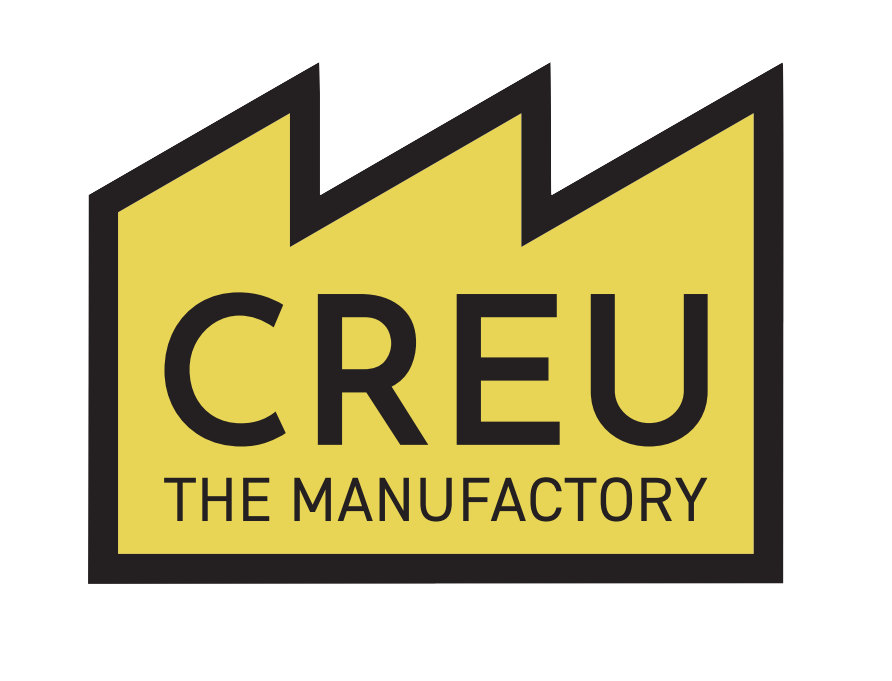

  
  <h1>CREU – The Manufactory</h1>

[[CREU-TheManufactory_Homepage|← Makerspace Homepage]]

> [!warning] Requires Training
> Book an [[EquipmentInduction|induction]] or speak to a Supervisor.  

# Hylka 858D Solder Rework Station — Overview

![[Images/Equipment_SolderRework.png|400]]

> **Purpose:** Hot-air solder rework station for desoldering and reflow of PCB components.

---

## 📍 Location
- Engineering Central B005

---

## 🧩 At a Glance
- Capacity / envelope: **Variable hot-air flow and temperature control**  
- Key capability: **Desoldering and reflow of surface-mount and through-hole components**  
- Typical use cases: **Electronics repair, component replacement, PCB assembly**  

*(For key features, essential safety reminders, and step-by-step startup, see the [[SolderRework_Quickstart|Quickstart Guide]].)*

---

## 🎓 Access & Training
- **Training required** before use  
- Induction arranged via [[EquipmentInduction|Equipment Induction Guidance]]  

| Apron Role                                  | Access                                 |
| ------------------------------------------- | -------------------------------------- |
| Basic User | ❌ No use                               |
| Maker-Pro   | ✅ Independent use (after induction)    |
| Supervisor   | ✅ May supervise & adjust settings       |
| Staff      | ✅ Full access, maintenance & servicing |

**Trainer Badge:**  
Once training is complete, students must request their apron-level badge via the CREU Digital Toolkit and add it to their collection for future access clearance.

*(For full safety guidance and procedures, see [[SolderRework_Safety_Operation|Safety & Operation]].)*

---

## ⚠️ Key Hazards
- Burns from hot nozzle and heated components — always return the gun to its holder.  
- Fumes from solder/flux — always use the extractor.  
- Electrical risk — inspect cable/plug; never use if damaged.  

**Emergency Information:**  
- First aid kit: **next to the rear entrance** of B005  
- First aiders: available **behind reception**  
- All students must have the **SafeZone app installed** on their phone for emergencies  

*(Detailed hazard controls: see [[SolderRework_Safety_Operation|Safety & Operation]].)*

---

## 📋 Checklists

### 🟢 Before Use
- Confirm training complete  
- Inspect cable, plug, housing for damage  
- Confirm nozzle fitted securely  
- Ensure extractor is switched on  
- Work area clean and tidy  

### 🛡️ Health & Safety
- Wear PPE (**safety goggles**)  
- Tie back long hair, secure clothing  
- Do not touch nozzle or point at others  
- Use tweezers/pliers for components  

### 🧹 After Use
- Turn down temperature, power off, allow fan to cool nozzle  
- Disconnect from mains before storage  
- Return nozzles and accessories  

---

## 🧰 Maintenance & Troubleshooting
Routine care and fault diagnosis must be **performed by or confirmed with a Supervisor**.  
See [[SolderRework_Troubleshooting|Troubleshooting & Maintenance]] for common troubleshooting tips, maintenance tasks, and fault advice.

---

## 🛠️ Fault Reporting
All faults must be logged through the **CREU Digital Toolkit**.  

Report anything that **stops safe use**, including:  
- Damaged cables, blocked airflow, or unusual noise  
- Excessive smoke or overheating  
- Electrical issues or safety concerns  

Submit a report: [[FaultReporting|Fault Reporting Guidance]]

---

## 📚 Resources
- Manufacturer manual: {{Link/file path}}  
- SOP: {{Link/file path}}  
- Risk Assessment: {{Link/file path}}  

---
